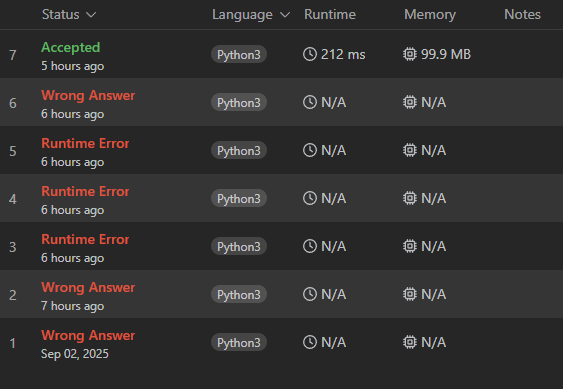

# Grafos 1: Resolvendo Problemas do LeetCode

**Número da Lista**: 1 
**Conteúdo da Disciplina**: Grafos 1  

### Participantes
Nome | Matrícula
|--|--|
[Christian Hirsch Santos](https://github.com/crstyhs)| 211045113
[Ian Lucca Soares Mesquita](https://github.com/IanLucca12) | 211045140 

## Sobre 
Foram escolhidos quatro exercícios da plataforma online [LeetCode](https://leetcode.com/):
- três de nível difícil.
- um de nível médio.

## Screenshots
### Questão
### [2876. Count Visited Nodes in a Directed Graph](https://leetcode.com/problems/count-visited-nodes-in-a-directed-graph/description/)

### Envio correto

### Tentativas

**[Solução do Problema](hard/2876_Count_Visited_Nodes_in_a_Directed_Graph.py)**

### [1192. Critical Connections in a Network](https://leetcode.com/problems/critical-connections-in-a-network/description/)

**[Solução do Problema]()**

## Vídeo Explicativo

[

## Linguagens
Python 

## Uso 
Rode os códigos no site do [LeetCode](https://leetcode.com/), em cada um dos problemas.
